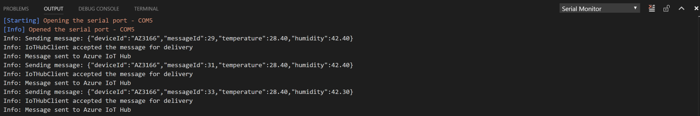

# Connect MXChip IoT Developer Kit to Azure IoT Hub in the cloud


## What you do


Connect MXChip IoT Developer Kit to an IoT hub that you create. Then you run a sample application to collect the temperature and humidity data from a sensor. Finally, you send the sensor data to your IoT hub.

## What you learn

* How to create an IoT hub and register a device for MXChip IoT Developer Kit
* How to collect sensor data by running a sample application on MXChip IoT Developer Kit
* How to send the sensor data to your IoT hub

## What you need

To complete this operation, you need the following parts from your MXChip IoT Developer Kit Starter Kit:

* The MXChip IoT Developer Kit board
* A Micro USB to Type A USB cable

You also need the following things for your development environment:

* Mac or PC that is running Windows or Ubuntu.
* Wireless network for MXChip IoT Developer Kit to connect to.
* Internet connection to download the configuration tool.
* [Visual Studio Code](https://code.visualstudio.com/)
* [Arduino Extension](https://marketplace.visualstudio.com/items?itemName=vsciot-vscode.vscode-arduino)

## Create an IoT hub and register a device for MXChip IoT Developer Kit

### To create your IoT hub in the Azure portal, follow these steps:

1. Sign in to the [Azure portal](https://portal.azure.com/).
1. Click **New** > **Internet of Things** > **IoT Hub**.

   

1. In the **IoT hub** pane, enter the necessary information for your IoT hub:

   

   * **Name**: The name for your IoT hub. If the name you enter is valid, a green check mark appears.
   * **Pricing and scale tier**: Select the free F1 tier for this demo. See [pricing and scale tier](https://azure.microsoft.com/pricing/details/iot-hub/).
   * **Resource group**: Create a resource group to host the IoT hub, or use an existing one. See [Using resource groups to manage your Azure resources](../azure-resource-manager/resource-group-portal.md).
   * **Location**: Select the closest location to you where the IoT hub is created.
   * **Pin to dashboard**: Select this option for easy access to your IoT hub from the dashboard.

1. Click **Create**. It could take a few minutes for your IoT hub to be created. You can see progress in the **Notifications** pane.

   

1. After your IoT hub is created, click it from the dashboard. Make a note of the **Hostname** value that is used later in this article, and then click **Shared access policies**.

   

1. In the **Shared access policies** pane, click the **iothubowner** policy, and then copy and save the **Connection string** value for your IoT hub. You use this value later in this article. For more information, see [Control access to IoT Hub](iot-hub-devguide-security.md).

   

You've now created your IoT hub. Ensure that you save the **Hostname** and **Connection string** values. They're used later in this article.


### Register a device for MXChip IoT Developer Kit in your IoT hub

Every IoT hub has an identity registry that stores information about the devices that are permitted to connect to the IoT hub. Before a device can connect to an IoT hub, there must be an entry for that device in the identity registry for that IoT hub.


In this section, you use a CLI tool called *iothub explorer*. Use this tool to register a device for MXChip IoT Developer Kit in the identity registry of your IoT hub.


> [!NOTE]
> iothub explorer requires Node.js 4.x or later to work properly.

To register a device for MXChip IoT Developer Kit, follow these steps:

1. [Download](https://nodejs.org/en/download/) and install the latest LTS version of Node.js, NPM included.
1. Install iothub explorer by using NPM.

   * Windows 7 or later:

     Start a command prompt as an administrator. Install iothub explorer by running the following command:

     ```bash
     npm install -g iothub-explorer
     ```

   * Ubuntu 16.04 or later:

     Open a terminal by using the keyboard shortcut Ctrl+Alt+T, and then run the following command:

     ```bash
     sudo npm install -g iothub-explorer
     ```

   * MacOS 10.1 or later:

     Open a terminal, and then run the following command:

     ```bash
     npm install -g iothub-explorer
     ```

3. Log in to your IoT hub by running the following command:

   ```bash
   iothub-explorer login [your IoT hub connection string]
   ```

4. Register a new device. In the next example, `deviceID` is `new-device`. Get its connection string by running the following command.

   ```bash
   iothub-explorer create new-device --connection-string
   ```

Make a note of the connection string of the registered device. It's used later.


> [!NOTE]
> To view the connection string of registered devices, run the `iothub-explorer list` command.


## Connect MXChip IoT Developer Kit with your computer
In this section, you you plug in your device to your computer for further use.

### Connect MXChip IoT Developer Kit to your computer

Use the Micro USB to Type A USB cable to connect MXChip IoT Developer Kit to your computer.

## Collect sensor data and send it to your IoT hub

In this section, you deploy and run a sample application on MXChip IoT Developer Kit. The sample application blinks the LED on MXChip IoT Developer Kit, and sends the temperature and humidity data collected from the DHT22 sensor to your IoT hub.

### Get the sample application from GitHub

The sample application is hosted on GitHub. Clone the sample repository that contains the sample application from GitHub. To clone the sample repository, follow these steps:

1. Open a command prompt or a terminal window.
1. Go to a folder where you want the sample application to be stored.
1. Run the following command:

   ```bash
   git clone https://github.com/VSChina/iot-hub-dev-kit-client-app
   ```

Install the package for MXChip IoT Developer Kit in the Visual Studio Code:

1. Open the folder where the sample application is stored.
1. Open the app.ino file in the app folder in the Visual Studio Code.
1. In the Visual Studio Code, press `F1` or `Ctrl + Shift + P` to open command palette, type `Arduino: Boards Manager`.
1. In `Arduino Boards Manager`, search for `AZ3166`, then click `Install`.
1. In Status Bar at the bottom, click `<Select Borad Type>`, then select `MXCHIP AZ3166`.

### Install necessary libraries

1. In the Visual Studio Code, press `F1` or `Ctrl + Shift + P` to open command palette, type `Arduino: Libraries Manager`.
1. Search for the following library names one by one. For each of library that you find, click **Install**.
   * `ArduinoJson`

### Config Wifi

Most IoT projects are relying on Internet connectivity. Use AP (Access Point) Mode on DevKit to configure WiFi.

### A. Enter AP Mode

Hold down button B, click Reset button, then release button B. The screen will display SSID of the DevKit as well as the configuration portal IP address:


### B. Connect to DevKit AP

Use your computer or mobile phone to connect to DevKit AP (highlighted in the screenshot above), leave the password as empty.

### C. Configure WiFi for DevKit

Open IP address on the screen in browser, select WiFi you want your DevKit connect to, then type the password. Click **'Connect'** to configure and connect to WiFi.


Once the connection is succeeded, the DevKit will reboot in a few seconds. After reboot, you can test the connection by clicking button A. The WiFi SSID and IP address will display on the screen.


**Note:** The IP address displays on the web page might not be identical to the actual IP address assigned and displayed on screen. This is normal as the WiFi is using DHCP to dynamically IP assignment.
{: .notice--info}

### Config credentials

1. Open the `config.h` file in the `app` folder.
1. Locate the following line of code and add the device connection string:
   ```c
   define DEVICE_CONNECTION_STRING "YOUR_DEVICE_CONNECTION_STRING"
   ```
1. Save the file with `Control-s`.


### Deploy the sample application to MXChip IoT Developer Kit

1. In the Visual Studio Code, in Status Bar at the bottom, click `<Select Serial Port>`, and then click the serial port `STMicroelectronics` for MXChip IoT Developer Kit.
1. Press `F1` or `Ctrl + Shift + P` to open command palette, type `Arduino: Upload` to build and deploy the sample application to MXChip IoT Developer Kit.

### Verify the sample application is running successfully

If you see the following output from the serial monitor window and the blinking LED on MXChip IoT Developer Kit, the sample application is running successfully.



## Next steps

You have successfully connected a MXChip IoT Developer Kit to your IoT hub, and sent the captured sensor data to your IoT hub. 

[!INCLUDE [iot-hub-get-started-next-steps](../../includes/iot-hub-get-started-next-steps.md)]
